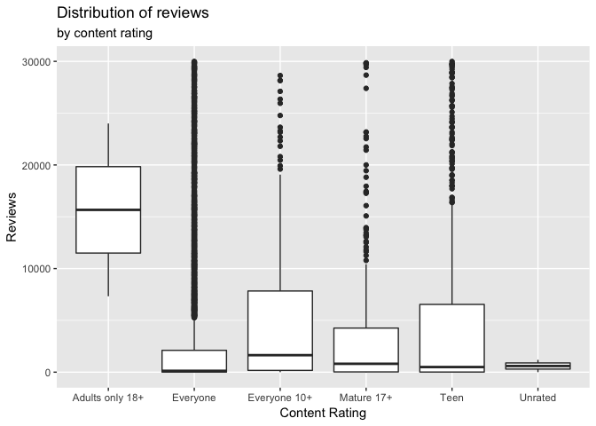

\[insert viral app\]
================
Baes 4 Bayes
April 29, 2019

### Introduction

Our general research question is: what makes a viral Google Play Store
app? We’ll base popularity on the number of reviews.

Our data comes from a public dataset on Kaggle described as “Web scraped
data of 10k Play Store apps for analysing the Android market.” Others
can also access it at this link:
<https://www.kaggle.com/lava18/google-play-store-apps/version/6>.

This data on Android apps was scraped from the Google Play Store by
Lavanya Gupta and was last updated 2 months ago. It includes just under
10,000 apps as its observations, and for each app, it records 13
variables: application name, category, rating, number of reviews, size,
number of installs, type (paid or free), price, content rating, genres,
date last updated, current version, and Android version.

Using this data, we hope to answer our research question on what factors
into a successful Android app, in a similar way to what has been done
widely for Apple App Store data but not Google Play Store data.

### Cleaning the Data

Before we can analyze this data, we needed to correct the data. It
appeared the values for row 10473 have been shifted to the left so that
the rating falls under the category, the number of reviews falls under
rating, etc. We removed this row for data integrity.

In addition, we saw several different values as NaN or “Varies with
device” in character lists, which we changed to NA for uniformity. We
also made the size and price variable numeric by removing the M or $
units.

The last issue with the data was that there were many duplicates of
apps, differing only slightly in review count for each. For example,
Facebook showed up twice. Since we want each observation to represent an
unique app, we averaged the reviews and thus condensed the duplicates
into single observations.

### Data Exploration

#### Picking a metric

To reiterate, we want to answer the question of what factors into a
successful Google Play Store app using the data we have.

First, we had to decide between using rating or popularity to rank the
success of an app. We started by looking at the distribution of rating:

<!-- -->

We also found the top 5 apps by rating:

    ## # A tibble: 5 x 13
    ## # Groups:   App [5]
    ##   App   Category Rating  Size Installs Type  Price Content_Rating Genres
    ##   <chr> <chr>     <dbl> <dbl> <chr>    <chr> <dbl> <chr>          <chr> 
    ## 1 Hoji… COMICS        5  37   1,000+   Free      0 Everyone       Comics
    ## 2 Amer… DATING        5   4.4 1,000+   Free      0 Mature 17+     Dating
    ## 3 Awak… DATING        5  70   100+     Free      0 Mature 17+     Dating
    ## 4 Spin… DATING        5   9.3 500+     Free      0 Teen           Dating
    ## 5 Girl… DATING        5   5   100+     Free      0 Mature 17+     Dating
    ## # … with 4 more variables: Last_Updated <chr>, Current_ver <chr>,
    ## #   Android_ver <chr>, Reviews_avg <dbl>

Because the ratings of apps were highly concentrated between 4 and 5 out
of a scale of 5, as shown above with many apps scoring a perfect 5,
there was not enough variation for us to use that as a measurement.
Thus, we picked popularity instead.

As for popularity, we had two choices as an index: number of installs or
number of reviews. The number of installs is more directly related to
popularity, since it is the number of people who use the app, while
reviews may include positive and negative feedback. However, the number
of installs is categorical (e.g. 100,00+) rather than numerical like the
number of reviews, so it gives us less informations.

    ## # A tibble: 11 x 2
    ##    Installs     Avg_Reviews
    ##    <chr>              <dbl>
    ##  1 1,000+              85.3
    ##  2 5,000+             100. 
    ##  3 10,000+            358. 
    ##  4 50,000+            972. 
    ##  5 100,000+          3593. 
    ##  6 500,000+         10002. 
    ##  7 1,000,000+       33113. 
    ##  8 5,000,000+      102633. 
    ##  9 10,000,000+     349750. 
    ## 10 50,000,000+    1230881. 
    ## 11 100,000,000+   4507331.

Here is a snapshot of a comparison of the number of installs and reviews
(averaged per group). We see that the number of installs and reviews are
relatively correlated, allowing us to use both to signify popularity.
Thus, we chose to use the numerical one, the number of reviews, as our
metric for an app’s success. Our research question became more of a
question of what makes an app viral.

#### Finding factors

We want to find factors correlated with high number of reviews per app.

Let’s start with category, since some categories might be more useful or
fun than others.

We want to explore how the category an app falls under affects the
average amount of reviews received. From this bar graph for average
reviews by category, we see that social is the category with the highest
average number of reviews at around 90,000 reviews. This is followed by
communication and game apps. The app categories with the least number of
average reviews were beauty, medical, and events.

<!-- -->

Another factor to explore is content rating. Maybe apps that are meant
for a broader audience, e.g. a rating of Everyone, would have more users
and thus more reviews.

To look at this, we want to create a visualization that demonstrates how
the distribution of average reviews varies by content rating. Our
initial boxplot had most of the data fall under average reviews of less
than 30,000 so we create a new boxplot that captures that portion of the
data and excludes in the visualization the outliers above that numnber
of average reviews.

<!-- -->

<!-- -->

Apps that have a content rating of Adults only 18+ have a higher median
of Reviews\_avg, but the other ratings (Everyone, Everyone 10+, Mature
17+, and Teen) have outliers skewing their data towards Reviews\_avg
values that are higher than the median and range of Adults only 18+.

It’s interesting that Adults only appears different from Mature 17+. We
then looked at what apps were in that content rating.

    ## # A tibble: 3 x 13
    ## # Groups:   App [3]
    ##   App   Category Rating  Size Installs Type  Price Content_Rating Genres
    ##   <chr> <chr>     <dbl> <dbl> <chr>    <chr> <dbl> <chr>          <chr> 
    ## 1 Mang… COMICS      4.6   4.9 500,000+ Free      0 Adults only 1… Comics
    ## 2 Draf… SPORTS      4.5  41   1,000,0… Free      0 Adults only 1… Sports
    ## 3 Mang… COMICS      3.8  NA   500,000+ Free      0 Adults only 1… Comics
    ## # … with 4 more variables: Last_Updated <chr>, Current_ver <chr>,
    ## #   Android_ver <chr>, Reviews_avg <dbl>

There are only 3, so we can mutate the dataset so these apps fall under
Mature 17+ instead for consistency. Let us see if the box plot changes:

<!-- -->

Now we see that the content rating Everyone 10+ has the highest median
instead.

#### Hypothesis Testing

Another factor we can look at is whether the app is free. We would
expect more people would want to and would be able to use a free app
rather than a paid one. We can explore the relationship between type of
app and reviews using a hypothesis test.

Do these data provide convincing evidence of a difference in a mean
amount of reviews between free apps and paid apps? We decided that this
is would be best decided by hypothesis test of independence, ran by a
simulation of type “permute”.

My null hypothesis is that there is no difference in the mean amount of
reviews between the two groups of apps while my alternative is that free
apps have a greater average of reviews than paid apps because we believe
that free apps would generally be more used by the public. This is a
one-sided hypothesis test.

    ## # A tibble: 2 x 2
    ##   Type     mean
    ##   <chr>   <dbl>
    ## 1 Free  264209.
    ## 2 Paid    8771.

We see that our sample statistic of the difference between the mean
amount of reviews for free and paid apps is 2.55437710^{5}.

We then continue on with a permute simulation. We again filtered out all
the observations where `Type` was “NaN”. The two variables we looked at
were `Reviews_avg` as the response and `Type` as the explanatory. We
created a hypothesis test simulation of 500 repetitions of type permute
with a set seed. It calculated differences in mean amount of reviews
between the two app groups (Free - paid), and we stored the results in
the null distribution, `rev_type`.

We can visualize this distribution using a histogram, with the sample
statistic marked with a green vertical line.

<!-- -->

Based on the visualization of the null distribution, the p-value appears
to be small. But we can directly calculate it as well.

    ## # A tibble: 1 x 1
    ##   p_val
    ##   <dbl>
    ## 1     0

The p-value of the distribution is 0, meaning that there is a 0%
probability that, by chance alone, the difference in means of amount of
reviews for free apps is greater than that of paid apps by
2.55437710^{5}. Because the p-value is less than our significance level
of 5%, we reject the null hypothesis that there is no difference in
means between amount of reviews for free and paid apps, and we have
strong evidence to suggest the alternative hypothesis that free apps
have greater average amount of reviews.

#### Making a Model

Now that we have guesses at what influences the virality of an app, we
can quantify them using a regression model. We want the response
variable to be the number of reviews, and the explanatory variables to
include the factors we explored above.

First, we looked at the distribution of Reviews\_avg, our response
variable.

<!-- -->

<!-- -->

<!-- -->

Even after zooming into areas of interest, cutting down the range each
time, we see that the reviews per app is heavily right-skewed. We
attempt to address this skewness by log transforming our response
variable, so we can create a regression model.

Before fitting our regression model, we need to remove all NA and NaN
values from our dataset.

    ## # A tibble: 6,776 x 13
    ## # Groups:   App [6,699]
    ##    App   Category Rating  Size Installs Type  Price Content_Rating Genres
    ##    <chr> <chr>     <dbl> <dbl> <chr>    <chr> <dbl> <chr>          <chr> 
    ##  1 Phot… ART_AND…    4.1  19   10,000+  Free      0 Everyone       Art &…
    ##  2 Colo… ART_AND…    3.9  14   500,000+ Free      0 Everyone       Art &…
    ##  3 U La… ART_AND…    4.7   8.7 5,000,0… Free      0 Everyone       Art &…
    ##  4 Pixe… ART_AND…    4.3   2.8 100,000+ Free      0 Everyone       Art &…
    ##  5 Pape… ART_AND…    4.4   5.6 50,000+  Free      0 Everyone       Art &…
    ##  6 Smok… ART_AND…    3.8  19   50,000+  Free      0 Everyone       Art &…
    ##  7 Infi… ART_AND…    4.1  29   1,000,0… Free      0 Everyone       Art &…
    ##  8 Gard… ART_AND…    4.4  33   1,000,0… Free      0 Everyone       Art &…
    ##  9 Kids… ART_AND…    4.7   3.1 10,000+  Free      0 Everyone       Art &…
    ## 10 Text… ART_AND…    4.4  28   1,000,0… Free      0 Everyone       Art &…
    ## # … with 6,766 more rows, and 4 more variables: Last_Updated <chr>,
    ## #   Current_ver <chr>, Android_ver <chr>, Reviews_avg <dbl>

We now use our new dataset, absent NA values, to fit a linear model.

We try to predict log(Reviews) by variables: Category, Size, Type,
Price, Content\_Rating, and an interaction between type and price. We
chose to leave out Rating and Installs because they are more appropriate
as different response variables. We also leave out Genres because of
collinearity (it is very similar to Categories). Lastly, we chose to
leave out Current\_ver because it is dependent on each app and thus
arbitrary.

Our full model is as follows:

    ## # A tibble: 41 x 2
    ##    term                        estimate
    ##    <chr>                          <dbl>
    ##  1 (Intercept)                  420.   
    ##  2 CategoryAUTO_AND_VEHICLES      0.392
    ##  3 CategoryBEAUTY                 0.385
    ##  4 CategoryBOOKS_AND_REFERENCE    0.818
    ##  5 CategoryBUSINESS               0.245
    ##  6 CategoryCOMICS                 0.896
    ##  7 CategoryCOMMUNICATION          2.90 
    ##  8 CategoryDATING                 0.434
    ##  9 CategoryEDUCATION              9.20 
    ## 10 CategoryENTERTAINMENT         16.6  
    ## # … with 31 more rows

We can view general information, including the R-squared value and the
Akaike information criterion (AIC) for our model.

    ## # A tibble: 1 x 11
    ##   r.squared adj.r.squared sigma statistic p.value    df  logLik    AIC
    ##       <dbl>         <dbl> <dbl>     <dbl>   <dbl> <int>   <dbl>  <dbl>
    ## 1     0.227         0.222  3.19      49.3       0    41 -17457. 34997.
    ## # … with 3 more variables: BIC <dbl>, deviance <dbl>, df.residual <int>

We see that the R-squared is 22.7%, meaning that roughly 22.7% of the
variability in reviews can be explained by the selected model.

We also see the AIC. This provides us with a limited information
theoretic description of the model, and it can serve as the comparative
basis for model selection, as below.

We then used the step function to evaluate permutations of the linear
model to discover the model with the lowest AIC. This model will be that
which makes the best tradeoff between R-squared and number of
parameters, by imposing a penalty on the inclusion of each parameter.

    ## Start:  AIC=15765.81
    ## log(Reviews_avg) ~ Category + Size + Type + Price + Content_Rating + 
    ##     Type * Size
    ## 
    ##                  Df Sum of Sq   RSS   AIC
    ## - Price           1      15.3 68595 15765
    ## <none>                        68580 15766
    ## - Size:Type       1     230.1 68810 15786
    ## - Content_Rating  4     689.7 69270 15826
    ## - Category       32    6302.0 74882 16298
    ## 
    ## Step:  AIC=15765.32
    ## log(Reviews_avg) ~ Category + Size + Type + Content_Rating + 
    ##     Size:Type
    ## 
    ##                  Df Sum of Sq   RSS   AIC
    ## <none>                        68595 15765
    ## - Size:Type       1     243.2 68838 15787
    ## - Content_Rating  4     689.1 69284 15825
    ## - Category       32    6287.5 74883 16296

As we can see above, the selected model removes the price variable only,
and it has the lowest AIC. We can now look again at the R-squared value:

    ## [1] 0.2264017

Our selected model also has a comparable R-squared to our initial model
(22.6% versus 22.7%).

#### Interpretation of Final Model

Our final model is seen below:

    ## # A tibble: 40 x 2
    ##    term                        estimate
    ##    <chr>                          <dbl>
    ##  1 (Intercept)                  419.   
    ##  2 CategoryAUTO_AND_VEHICLES      0.393
    ##  3 CategoryBEAUTY                 0.386
    ##  4 CategoryBOOKS_AND_REFERENCE    0.819
    ##  5 CategoryBUSINESS               0.245
    ##  6 CategoryCOMICS                 0.898
    ##  7 CategoryCOMMUNICATION          2.89 
    ##  8 CategoryDATING                 0.435
    ##  9 CategoryEDUCATION              9.21 
    ## 10 CategoryENTERTAINMENT         16.7  
    ## # … with 30 more rows

Let us interpret this model in the context of our data:

Of the many Category coefficients, the ones we will focus on are:
CategoryMEDICAl and CategoryENTERTAINMENT. CategoryMEDICAL had the
smallest coefficient and CategoryENTERTAINMENT had the largest. All else
held constant, for medical apps, the number of reviews is expected to be
lower than that of art and design apps, on average, by a factor of 0.13.
All else held constant, for entertainment apps, the number of reviews is
expected to be higher than that of art and design apps, on average, by a
factor of 16.7.

All else held constant, for each megabyte (MB) the size of the app
increases, the number of reviews for the app is expected to be higher,
on average, by a factor of 1.05.

All else held constant, for apps that cost money, the number of reviews
is expected to be lower than that of free apps, on average, by a factor
of 0.26.

All else held constant, for apps rated for everyone 10+, the number of
reviews is expected to be higher than that of apps rated for everyone,
on average, by a factor of 4.32. All else held constant, for apps rated
for mature 17+, the number of reviews is expected to be higher than that
of apps rated for everyone, on average, by a factor of 1.93. All else
held constant, for apps rated for teens, the number of reviews is
expected to be higher than that of apps rated for everyone, on average,
by a factor of 1.96. All else held constant, for unrated apps, the
number of reviews is expected to be lower than that of apps rated for
everyone, on average, by a factor of 0.97.

### Conclusion

When we started our project, our goal was to determine what makes a
Google Play Store App successful. As we began to figure out how to
answer that question, we found that there were several ways to measure
an app’s success. Rather than rating, we chose to measure an app’s
virality based on how many reviews an app received, as a proxy for its
popularity.

It is important to note that, while the two are highly correlated,
popularity/installs is based on how many people like the app enough to
use it, while virality/reviews can be either strong positive or negative
feelings toward the app. Virality is about the attention an app gets,
not if users like it, so our research question became nuanced in that
way.

Using a linear regression model, we found that the category, size, type,
and content rating are all variables that influence the number of
reviews an app receives. Because we log transformed the response
variable to account for skew, we also transformed the coefficient terms
of our final model using exponents so that they became factors for
multiplication.

Among the levels of categories, CategoryMEDICAL had the smallest
coefficient below 1 and CategoryENTERTAINMENT had the largest
coefficient above 1. The coefficient for Size was 1.05, also above 1.
The coefficient for TypePaid was 0.26, which is below 1. The highest
coefficient for content rating was 4.32 for Everyone 10+. Since we want
to know what factors cause an app to go viral, meaning we want to know
what increases reviews, we look to see which have coefficients above 1,
as that multiplication factors means an increase. Thus, a developer
wanting to create a new viral app in the Google Play Store should create
a large, free entertainment app that is for Everyone 10+.

These conclusions are supported by our earlier exploratory data
analysis. We saw visually that the number of reviews differed
significantly between categories, with entertainment apps toward the top
for reviews and medical toward the bottom. Also, the box plots showed
the Everyone 10+ content rating as the rating with the highest median.

An important nuance to note is that, although the numeric variable for
price was dropped from the model, whether an app is free remained in the
model and is supported by the one-sided hypothesis test for
independence. The p-value of 0 found provided strong evidence that free
apps tend to have more reviews.

#### Discussion

Looking at our statistical methods, the strong right skew creates an
issue. There are a very large number of apps with zero reviews and also
few viral apps with many reviews (e.g. Instagram). This is an issue when
choosing between median and mean, since median is resistant to outliers
but the point of our research question is to ask about virality, meaning
we should consider the outliers strongly. We chose to use the mean but
it may have been worth doing the same analysis using median (more
statistically accurate) and comparing the two for the best of both
worlds.

Looking at the data itself, there are some reliability issues. The
person who web scraped the data did not go into depth about their
process, so how they chose around 10,000 apps from the 2.6 million apps
on the Google Play Store is unknown. We cannot know that they chose
random apps or if there is actually sampling error.

Also, it is important to note that apps can go viral very quickly,
e.g. Flappy Bird’s popularity boost mostly happened within a month. The
web-scraped data was last updated 2 months ago, which may account for
why many apps have no reviews (they were new to the store). That lack of
recency may also mean some of the data is outdated now. It is also
unclear if the entire dataset was re-scraped, new observations were
added, or data was corrected during the update.

If we were to start over or to continue with this project, our first
step would be to web scrape this data ourselves. This would allow
greater control and transparency in the web scraping/sampling process so
we could be sure we had a random, representative, and recent sample of
data.

Another option to simplify analysis would be to group certain categories
together, e.g. grouping Social and Communication together, Art and
Photography, Weather and Maps under Tools, or Books and Education. That
might help account for why Social and Communication have the highest
average number of reviews but Entertainment has the largest coefficient
in our model. Also, we would imagine similar apps to belong to one of
those three groups, e.g. social media and messaging.
